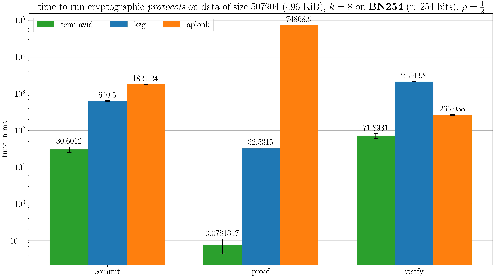

\usetikzlibrary{shapes,arrows,positioning,calc}

# Abstract

We present **Komodo**, a library that allows to encode data with erasure-code
techniques such as Reed-Solomon encoding, prove the resulting shards with
cryptographic protocols, verify their integrity on the other end of any
distributed network and decode the original data from a subset of said shards.
The library is implemented in the _Rust_ programming language and
available on the ISAE-SUPAERO GitLab instance [^1] with a mirror on GitHub [^2].
**Komodo** should be of interest for people willing to explore the field of
cryptographically-proven shards of data in distributed systems or data
availability sampling settings.

[^1]: GitLab source code: [https://gitlab.isae-supaero.fr/dragoon/komodo](https://gitlab.isae-supaero.fr/dragoon/komodo)
[^2]: GitHub mirror for issues and pull requests: [https://github.com/dragoon-rs/komodo](https://github.com/dragoon-rs/komodo)

# Keywords

Cryptography; Erasure codes; Distributed systems; Data availability sampling;

# Summary

**Komodo** is a software library that provides a _Rust_ API to achieve the
following on any input data in a distributed network or setup:

- `encode`: data is encoded into _shards_ with a $(k, n)$ code. This adds
  redundancy to the data, making the network more resilient to failure,
  fragmentation, partitioning, loss or corruption.
- `commit` and `prove`: all $n$ encoded shards are proven with one of three
  available cryptographic protocols (see below for more information). This step
  consists in attaching extra information to them and sharing augmented _blocks_
  of data onto the network. This extra information should guarantee
  with a very high probability that a given shard has been generated indeed
  through an expected encoding process, namely a polynomial evaluation or vector
  inner-product encoding such as Reed-Solomon.
- `verify`: any shard is verified individually for its validity. This allows to
  discriminate invalid or corrupted shards without requiring a full decoding of
  the original data.
- `decode`: the original data is decoded using any subset of $k$ valid shards.

The previous key steps of all the protocols implemented use some basic
mathematical objects.
On one hand, `encode` and `decode` use elements of a finite field $\mathbb{F}$
with a large prime order $p$. $p$ is required to be large, usually $64$ bits or
more, for security reasons, to avoid collisions between shards. Elements in
$\mathbb{F}$ follow the usual operations on numbers: _addition_, _substraction_,
_multiplication_ and _division_.
On the other hand, `commit`, `prove` and `verify` use elements of the additive
subgroup $\mathbb{G}$ of an elliptic curve $\mathbb{E}$. For consistency, there
has to be an isomorphism between $\mathbb{G}$ and $\mathbb{F}$. Elements in
$\mathbb{G}$ follow the rules of any additive group: _addition_ and _subtraction_.
Multiplication by an integer scalar value can be constructed as a repeated
_addition_.

This version of **Komodo** ships three cryptographic methods to prove the
integrity of encoded data:

- **KZG+**: This method is based on the well-known _zero-knowledge_ protocol
  **KZG** [@kate2010constant] and its multi-polynomial extension
  [@boneh2020efficient]. In **KZG**, the data is interpreted as a polynomial.
  Then a commitment of this polynomial, common to all shards, is computed.
  Finally, a proof, unique per shard, is computed and attached to the associated
  shard. The multi-polynomial extension allows to scale to bigger data by still
  computing a single proof per shard regardless of the size of the input data.
- **aPlonK**: This method is based on the following works: **PlonK**
  [@gabizon2019plonk] and **aPlonK** [@ambrona2022aplonk]. Through recursion and
  tree _folding_, it achieves smaller commitment sizes as compared to **KZG+**
  at the cost of very expensive proving times.
- **Semi-AVID**: This last method is the simplest and the fastest. It is based
  on the work of **Semi-AVID-PR** [@nazirkhanova2022information]. Instead of
  computing proofs as extra cryptographic elements, **Semi-AVID** leverages the
  _homomorphic_ property of the `commit` operation which makes sure _the linear
  combination of commitments is equal to the commitment of the same linear
  combination_.

A beta version of **Komodo** has been used in a previous evaluation paper
[@stevan2024performance] and is still available for reference at
[https://gitlab.isae-supaero.fr/dragoon/pcs-fec-id](https://gitlab.isae-supaero.fr/dragoon/pcs-fec-id).

**Komodo** is based on the Arkworks library [@arkworks] which provides
implementations of elliptic curves, fields and polynomial algebra used in all
the proving protocols.

A first method that has been considered was _Merkle trees_ [@merkle1987digital].
They cut the data in leaves of a binary tree where the value inside a node is
computed as the hash of the concatenation of its two children. This process
produces a root, the _Merkle root_, and any leaf can be proven as being part of
the tree by giving a _Merkle path_ in the tree, which is simply a path of
intermediate hashes that allow to recompute the _Merkle root_ from the leaf.
This method, once applied to our use case and despite its simplicity, was
unfortunately only proving that one shard was part of the _Merkle tree_ and not
that it had been generated through a valid encoding.

As described in [@stevan2024performance], the protocols are usually introduced
interactively, i.e. the _prover_ and the _verifier_ need to be involved in an
interactive discussion where the _verifier_ imposes challenges to the _prover_
and the latter tries to convince the former. This is not very practical and the
implementation uses a technic known as the _Fiat-Shamir transform_ from
[@fiat1986prove].

## General data flow in **Komodo**

This section shows a high-level overview of the data flow in **Komodo**.
Some data $D$ is first encoded. Then _commitments_ and _proofs_ are computed.
Finally, on the other end, blocks are verified and decoded.

\tikzset{
    block/.style = {draw, fill=white, rectangle, minimum height=3em, minimum width=3em},
    tmp/.style  = {coordinate},
    sum/.style= {draw, fill=white, circle, node distance=1cm},
    input/.style = {coordinate},
    output/.style= {coordinate},
    pinstyle/.style = {pin edge={to-,thin,black}}
}

\begin{tikzpicture}[auto, node distance=2cm,>=latex']
    \node [block, fill=green!50] (data) {$D$};
    \node [block, below of=data, fill=red!50] (source) {$(s_i)$};
    \node [block, right of=source, node distance=4cm] (encoded) {$(e_j)$};
    \node [block, right of=encoded, node distance=3cm, fill=yellow!20] (commitment) {$c$};
    \node [block, below of=commitment, node distance=1.3cm, fill=yellow!30] (proof) {$(\pi_j)$};
    \node [block, right of=commitment, node distance=1.5cm, fill=blue!50] (blocks) {$(b_j)$};
    \node [block, right of=blocks, node distance=3cm, fill=blue!20] (verified) {$(b^*_j)$};
    \node [block, above of=verified, node distance=2cm, fill=red!20] (decoded) {$(\tilde{s}_i)$};
    \node [block, left of=decoded, fill=green!20] (data_) {$\tilde{D}$};
    \draw [->] (data) -- node{split into elements of $\mathbb{F}$} (source);
    \draw [->] (source) -- node{\texttt{encode(k, n)}} (encoded);
    \draw [->] (encoded) -- node[name=a,anchor=south]{\texttt{commit}} (commitment);
    \draw [->] (a) |- node[anchor=north]{\texttt{prove}} (proof);
    \draw [->] (commitment) -- (blocks);
    \draw [->] (proof) -| (blocks);
    \draw [->] (blocks) -- node{\texttt{verify}} (verified);
    \draw [->] (verified) -- node{\texttt{decode}} (decoded);
    \draw [->] (decoded) -- (data_);
\end{tikzpicture}

where

- $S = (s_i)_{1 \leq i \leq k} \in \mathcal{M}_{m \times k}(\mathbb{F})$ is the
  matrix of source shards
- $M \in \mathcal{M}_{k \times n}(\mathbb{F})$ is the encoding matrix
- $E = (e_j)_{1 \leq j \leq n} = S \times M \in \mathcal{M}_{m \times n}(\mathbb{F})$
  is the matrix of encoded shards
- $c \in \mathbb{F}$ is the common _commitment_
- $(\pi_j)_{1 \leq j \leq n} \in \mathbb{F}^{n}$ are the proofs for each _shard_
- $(b_j)_{1 \leq j \leq n}$ are the final proven blocks, i.e. $(e_j, c, \pi_j)$

A valid and robust system should satisfy and guarantee the two following
properties:

- all blocks $(b^*_j)$ are valid and all other blocks are invalid
- $(\tilde{s}_i) \stackrel{?}{=} (s_i)$ and thus $\tilde{D} \stackrel{?}{=} D$

> **Note**
>
> In the case of **Semi-AVID**, there could be more steps before the
> \texttt{verify} stage. Indeed, because it is the only method that does not
> require the full original data to produce proofs, it does support a technic
> that we call _recoding_, i.e. generating new shards on the fly with any amount
> of other shards, including strictly less than $k$ shards.

## Examples

We provide full examples for the three protocols in `examples/`. Below is a
simplified version of these examples that follows the diagram from the previous
section.

> **Note**
>
> The following snippets of code are not fully-valid _Rust_ code. They have been
> slightly simplified for the sake of readability in this document. An example
> of such simplification is that we have ommitted the use of a `main` function,
> which is mandatory in a _Rust_ program.
>
> All dependencies used below are defined unambiguously in `Cargo.toml`.

First, some definitions need to be imported.

> ```rust
> // definitions used to specify generic types
> use ark_bls12_381::{Fr as F, G1Projective as G};
> use ark_poly::univariate::DensePolynomial as DP;
>
> // the code from the Komodo library
> use komodo::{algebra::linalg::Matrix, fec::{decode, encode}, zk::setup}
> ```

Then we can define a pseudo-random number generator, the parameters of our code
$(k, n)$, the input bytes and a _trusted setup_, which is a sequence of powers
of a secret element of $\mathbb{F}$.

> ```rust
> let mut rng = ark_std::test_rng();
>
> let (k, n) = (3, 6);
> let bytes: Vec<u8> = vec![
>   // fill with real data
> ];
>
> let powers = setup::<F, G>(bytes.len(), &mut rng)?;
> ```

Following the diagram above, the next step is to encode and prove the data to
generate $n$ encoded and proven blocks.

> ```rust
> let encoding_matrix = Matrix::random(k, n, &mut rng);
> let shards = encode(&bytes, &encoding_matrix)?;
> let proofs = prove::<F, G, DP<F>>(&bytes, &powers, encoding_matrix.height)?;
> let blocks = build::<F, G, DP<F>>(&shards, &proofs);
> ```

Only $k$ blocks need to be received.

> ```rust
> let received_blocks = vec![ /* any subset of at least k blocks */ ]
> ```

Finally, these blocks can be verified with `verify`.

> ```rust
> // we assume here that all blocks are still valid
> for b in &received_blocks {
>     assert!(verify::<F, G, DP<F>>(b, &powers)?);
> }
> ```

And the original data can be decoded using any subset of $k$ valid blocks

> ```rust
> assert_eq!(
>     bytes,
>     decode(received_blocks[0..k].iter().cloned().map(|b| b.shard).collect())?;
> );
> ```

## Quality control

**Komodo** provides a test suite to give the highest confidence possible in the
validity of the source code.

To achieve this goal, all matrix operations are tested as well as the encoding
and decoding process and the three cryptographic protocols.

## Some measurements

Building on the work from [@stevan2024performance], we have conducted some
measurements of the performance of the three methods.

The time to run `commit`, `prove` and `verify` has been measured for $k = 8$ and
a code rate $\rho = \frac{1}{2}$, i.e. $n = 16$, on the BN-254 elliptic curve, and
for small and large input data.



**Semi-AVID** is the best for committing, proving and verifying small files,
as can be seen in \autoref{fig:small}.


**aPlonK** is slightly better for verifying large files, as can be seen in
\autoref{fig:large}, but still suffers from performance orders of magnitude
worst than **Semi-AVID** for committing and proving.

**KZG+** is neither good nor too bad.

# Statement of need

> TODO: develop this

the use case is any system that meet the following criteria

- distributed, e.g. drones
- need for data robustness, e.g. by introducing redundancy
- no trust in others nor the environment, need to prove the integrity of the data

A few libraries provide similar functionalities, with a few gaps filled by
`Komodo`.

The `arkworks` ecosystem [@arkworks] is probably the closest library, providing
many of the necessary building bricks involved in Data Availability Sampling:
prime fields, possibly paired with elliptic curves like BLS12-381 or BN254 among
many others; linear algebra operations like polynomial operations and matrix
operations; and polynomial commitment. On top of those features, `Komodo` adds
Reed-Solomon encoding, tightly integrated with proof generation.

The Rust implementation of Reed-Solomon erasure coding [@rust-rse] provides
mechanisms to encode and decode data into raw shards, using elements of finite
fields $\mathbb{F}_{2^8}$ or $\mathbb{F}_{2^{16}}$, containing respectively
$2^8$ and $2^{16}$ elements. `Komodo` adds the proving mechanisms, and makes it
possible to use elements from `arkworks`' prime fields, possibly paired with
elliptic curves.

`Komodo` also adds a unified high-level API, allowing to benchmark and compare
different combinations of prime fields, elliptic curves and polynomial
commitment schemes, as we did in two publications [@stevan2024performance; @stevan2025performance].
Finally, a modular design allows to extend `Komodo` with new polynomial
commitment schemes, which performance can be evaluated in the same benchmarking
conditions.

Scroll [@scroll2024], Avail [@avail2024] and Danksharding [@danksharding2024].

**Komodo** can be extended with either

new encoding methods in the `fec` module
proof protocols, just as with the `kzg`, `aplonk` and `semi_avid` modules

and Tezos [@tezos2024aplonk].

contact us at `firstname.lastname@isae-supaero.fr` or at one of the
_support pages_ below

**support**: we provide support on GitHub

- bug reports and feature requests [https://gitlab.isae-supaero.fr/dragoon/komodo/-/issues](https://gitlab.isae-supaero.fr/dragoon/komodo/-/issues)
- contributions [https://gitlab.isae-supaero.fr/dragoon/komodo/-/merge_requests](https://gitlab.isae-supaero.fr/dragoon/komodo/-/merge_requests)

# Availability

This section details requirements for **Komodo** to work properly and
information about where the source code is hosted.

## Operating system

**Komodo** has been made on Linux but should be crossplatform by construction.

## Programming language

**Komodo** is fully written in _Rust_.

One can install _Cargo_ [^3], e.g. with _rustup_ [^4], and the exact version
is taken care of by `rust-toolchain.toml`.

[^3]: _Cargo_: [https://doc.rust-lang.org/cargo/](https://doc.rust-lang.org/cargo/)
[^4]: `rustup`: [https://rustup.rs/](https://rustup.rs/)

## Additional system requirements

This depends on the data for the memory usage but all experiments and
measurements have been conducted on regular _home_ computers.

> ```json
> {
>   "Architecture": "x86_64",
>   "CPU op-mode(s)": "32-bit, 64-bit",
>   "Address sizes": "46 bits physical, 48 bits virtual",
>   "Byte Order": "Little Endian",
>   "CPU(s)": "20",
>   "On-line CPU(s) list": "0-19",
>   "Model name": "12th Gen Intel(R) Core(TM) i7-12800H",
>   "CPU family": "6",
>   "Model": "154",
>   "Thread(s) per core": "2",
>   "Core(s) per socket": "14",
>   "Socket(s)": "1",
>   "Stepping": "3",
>   "CPU max MHz": "4800.0000",
>   "CPU min MHz": "400.0000",
>   "BogoMIPS": "5606.40",
>   "Virtualization": "VT-x",
>   "L1d cache": "544 KiB (14 instances)",
>   "L1i cache": "704 KiB (14 instances)",
>   "L2 cache": "11.5 MiB (8 instances)",
>   "L3 cache": "24 MiB (1 instance)",
>   "NUMA node(s)": "1",
>   "NUMA node0 CPU(s)": "0-19"
> }
> ```

## Dependencies

All dependencies are taken care of by _Cargo_ and `Cargo.toml`.

## Software location

**Code repository**: GitLab

- Name: **Komodo**
- Persistent identifier: [https://gitlab.isae-supaero.fr/dragoon/komodo](https://gitlab.isae-supaero.fr/dragoon/komodo)
- Licence: MIT
- Date published: 05/11/2024

**Mirror**: GitHub

- Name: **Komodo**
- Persistent identifier: [https://github.com/dragoon-rs/komodo](https://github.com/dragoon-rs/komodo)
- Licence: MIT
- Date published: 05/11/2024

## Language

Everything is written in english.

# Acknowledgements

This work was supported by the Defense Innovation Agency (AID) of the French
Ministry of Defense through the Research Project DRAGOON: Dependable distRibuted
storAGe fOr mObile Nodes (2022 65 0082).

# References
