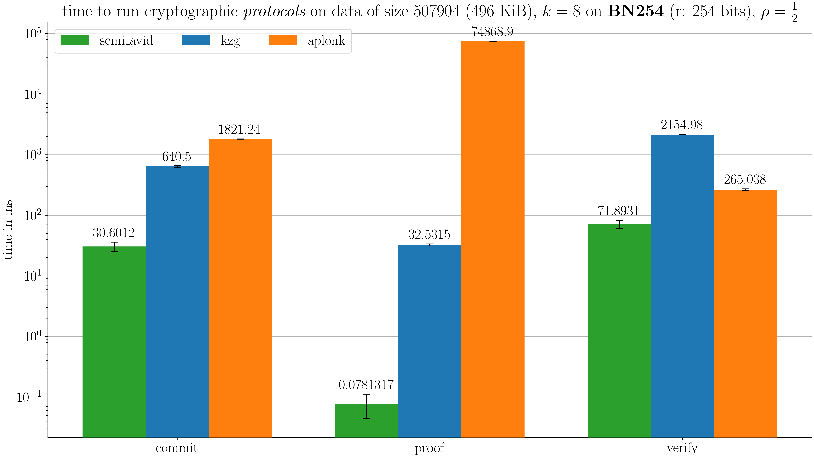
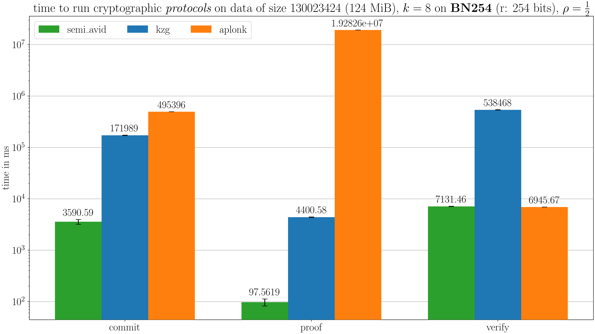

# Summary

We present **Komodo**, a library that allows to (**1**) encode data with forward erasure-code (FEC) techniques such as Reed-Solomon encoding, (**2**) prove the resulting _shards_ with cryptographic protocols, (**3**) verify their validity on the other end of any distributed network and (**4**) decode the original data from a subset of said _shards_; [@stevan2024performance] and [@stevan2023assessing].
The library is implemented in the _Rust_ programming language and available on the ISAE-SUPAERO GitLab instance [^1] with a mirror on GitHub [^2], both released under the MIT license.
**Komodo** should be of interest for people willing to explore the field of cryptographically-proven _shards_ of data in distributed systems or data availability sampling settings.

A _shard_ of data is said to be _valid_ if it has been generated by a correct FEC encoding of the data.

**Komodo** implements a protocol API to achieve the following on any input data in a distributed network:

- `encode`: encodes data into _shards_ with a Reed-Solomon $(k,n)$-code.
  This adds redundancy to the data, making the network more resilient to failure, fragmentation, partitioning, loss or corruption.
- `commit`: commit the input data into a _commitment_ common to all _shards_.
- `prove`: generate one proof for all $n$ _shards_ with one of three available cryptographic protocols (see below for more information).
  This extra information guarantees a given _shard_ is valid, except with negligible probability.
- `verify`: verifies a _shard_ individually for its validity using the data _commitment_ and the _shard_ proof.
  This allows to discriminate invalid or corrupted _shards_ without any decoding attempt.
  Without this shard-level verification step, it is impossible to know if a _shard_ is valid until the decoding step.
  Then, when decoding fails, it is not possible to know which _shards_ were invalid, leading to a _try-and-error_ process that is not scalable.
- `decode`: decodes the original data using any subset of $k$ independent and valid _shards_.

**Komodo** provides the three following cryptographic protocols:

- **KZG+** (short for the first letters of the authors' names): based on [@kate2010constant] and its multi-polynomial extension [@boneh2020efficient]
- **aPlonK** (short for _**A**ggregated **P**ermutations over **L**agrange-bases for **O**ecumenical **N**oninteractive arguments of **K**nowledge_): based on **PlonK** [@gabizon2019plonk] and **aPlonK** [@ambrona2023aplonk]
- **Semi-AVID** (short for _Semi **A**synchronous **V**erifiable **I**nformation **D**ispersal_): based on **Semi-AVID-PR** [@nazirkhanova2022information]

**Komodo** is based on the Arkworks library [@arkworks] which provides implementations of elliptic curves, fields and polynomial algebra.

[^1]: GitLab source code: [https://gitlab.isae-supaero.fr/dragoon/komodo](https://gitlab.isae-supaero.fr/dragoon/komodo)
[^2]: GitHub mirror for issues and pull requests: [https://github.com/dragoon-rs/komodo](https://github.com/dragoon-rs/komodo)

# Keywords

Cryptography;
Erasure codes;
Distributed systems;
Verifiable information dispersal;
Data availability;

# Statement of need

The verification mechanisms provided by **Komodo** can help implementing verifiable information
dispersal or data availability schemes in a distributed storage system or in a blockchain.

For instance, in a distributed storage system, nodes can use **Komodo** to encode an incoming data
into shards; commit them to the initial data; compute individual shard proofs; bundle shards,
commitments and proofs into messages; and distribute these messages across the network. Any node that
receives a block can then verify its validity before storing or forwarding it. This ensures data
robustness and trustworthiness when a node eventually decodes the data from the shards bundled in
valid messages.

Several blockchain projects use some of these mechanisms to verify data availability:

- Celestia uses 2D Reed-Solomon-based codes with Merkle trees [@rsmt2d; @albassam2019frauddataavailabilityproofs]
- Ethereum Danksharding [@ethereum2024danksharding] uses 2D Reed-Solomon with KZG polynomial commitments

Such projects could use or extend Komodo to benchmark different schemes.

A few libraries provide similar functionalities, with a few gaps filled by **Komodo**:

- The `arkworks` ecosystem [@arkworks] is probably the closest library, providing many of the
  necessary building blocks involved in Data Availability Sampling: prime fields, possibly paired
  with elliptic curves like BLS12-381 or BN254 among many others; linear algebra operations like
  polynomial operations and polynomial commitment. On top of those features, **Komodo** adds
  Reed-Solomon encoding, tightly integrated with proof generation.

- The Rust implementation of Reed-Solomon erasure coding [@rust-rse] provides mechanisms to encode
  and decode data into raw shards, using elements of finite fields $\mathbb{F}_{2^8}$ or
  $\mathbb{F}_{2^{16}}$, containing respectively $2^8$ and $2^{16}$ elements. **Komodo** adds the
  proving mechanisms, and makes it possible to use elements from `arkworks`' prime fields.

- **Komodo** also adds a unified benchmarking API, allowing to compare different combinations of
  prime fields, elliptic curves and polynomial commitment schemes, as we did in two publications
  [@stevan2024performance; @stevan2023assessing]. Finally, a modular design allows to extend
  **Komodo** with new polynomial commitment schemes or new encoding methods, which performance can
  be evaluated in the same benchmarking conditions.

# Some measurements

Building on the work from [@stevan2024performance], we have conducted some
measurements of the performance of the three methods. All experiments were run
on a laptop with x86‑64 Intel Core i7‑12800H (14 cores / 20 threads,
0.4–4.8 GHz) system with a 3-level cache hierarchy (L1d 544 KiB, L1i 704 KiB, L2
11.5 MiB, L3 24 MiB) and a single NUMA node. Only one thread was used for all
experiments.

The time to run `commit`, `prove` and `verify` has been measured for $k = 8$ and
a code rate $\rho = \frac{1}{2}$, i.e. $n = 16$, on the BN-254 elliptic curve, and
for small and large input data.
The `encode` and `decode` steps are the same for all protocols and thus have
been omitted from the analysis below. `encode` involves a matrix multiplication
which takes around $10\mu s$ with $k = 8$. `decode` has an extra matrix inversion
of size $k = 8$ taking around $250 \mu s$.

\autoref{fig:small} shows that **Semi-AVID** is the best for committing, proving and verifying small files.
\autoref{fig:large} shows that **aPlonK** is slightly better for verifying large files but still suffers from performance orders of magnitude worst than **Semi-AVID** for committing and proving.
Both figures show that **KZG+** is neither good nor too bad.

# Additional information

**Komodo** is fully written in _Rust_ and thus all dependencies are taken care of by _Cargo_ and `Cargo.toml`.

## Contact

- by email: `firstname.lastname@isae-supaero.fr`
- ticket tracker: [https://github.com/dragoon-rs/komodo/issues](https://github.com/dragoon-rs/komodo/issues)
- contributions: [https://github.com/dragoon-rs/komodo/pulls](https://github.com/dragoon-rs/komodo/pulls)

# Acknowledgements

This work was supported by the Defense Innovation Agency (AID) of the French
Ministry of Defense through the Research Project DRAGOON: Dependable distRibuted
storAGe fOr mObile Nodes (2022 65 0082).

# References
